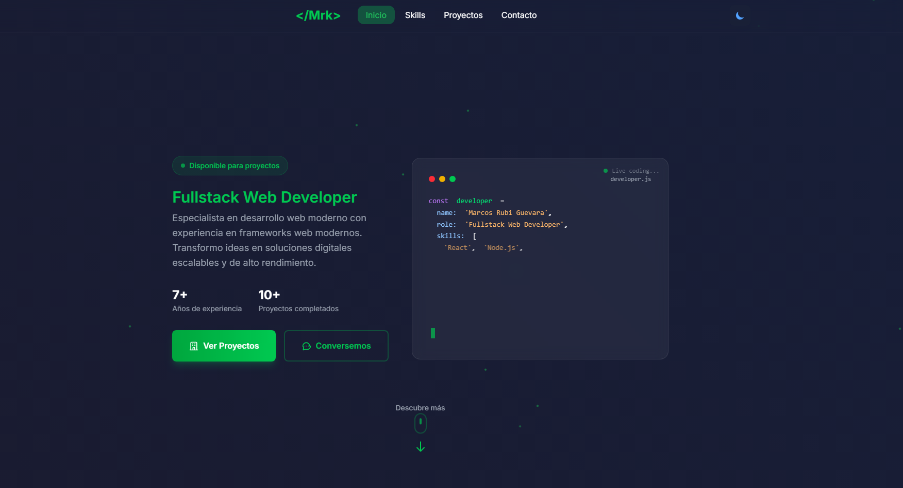

# 🚀 Portfolio - Marcos Rubi Guevara

<div align="center">



**Portafolio personal de desarrollo full-stack construido con Astro y diseño moderno**

[](https://astro.build)
[](https://www.typescriptlang.org/)
[](https://tailwindcss.com)
[](https://vercel.com)

[🌐 Ver Demo](https://mrk2016.github.io/Portafolio/) • [📧 Contacto](mailto:markrubi2@gmail.com) • [💼 LinkedIn](https://www.linkedin.com/in/markrubi26/)

</div>

## 📋 Tabla de Contenidos

- [✨ Características](#-características)
- [🛠️ Tecnologías](#️-tecnologías)
- [🚀 Instalación](#-instalación)
- [📁 Estructura del Proyecto](#-estructura-del-proyecto)
- [🎨 Características Técnicas](#-características-técnicas)
- [📱 Responsive Design](#-responsive-design)
- [🌙 Modo Claro/Oscuro](#-modo-clarooscuro)
- [🚀 Despliegue](#-despliegue)
- [📈 Proyectos Destacados](#-proyectos-destacados)
- [🤝 Contribuir](#-contribuir)
- [📄 Licencia](#-licencia)

## ✨ Características

🎯 **Diseño Moderno y Profesional**

- Interfaz limpia con efectos glassmorphism
- Animaciones suaves y micro-interacciones
- Diseño responsive para todos los dispositivos
- Modo claro/oscuro con transiciones elegantes

⚡ **Performance Optimizada**

- Construido con Astro para máxima velocidad
- Imágenes optimizadas y lazy loading
- CSS y JavaScript minificados
- Score perfecto en Lighthouse

🎨 **Características Visuales**

- Gradientes animados y efectos hover
- Iconos SVG personalizados
- Tipografía moderna con Inter
- Partículas animadas de fondo

📱 **Experiencia de Usuario**

- Navegación suave entre secciones
- Filtros interactivos de proyectos
- Modal de galería para imágenes
- Indicadores de scroll animados

## 🛠️ Tecnologías

### Frontend

- **[Astro](https://astro.build)** - Framework web moderno
- **[TypeScript](https://www.typescriptlang.org/)** - Tipado estático
- **[Tailwind CSS](https://tailwindcss.com)** - Framework CSS utility-first
- **[Inter Font](https://rsms.me/inter/)** - Tipografía moderna

### Herramientas de Desarrollo

- **[Vite](https://vitejs.dev)** - Build tool rápido
- **[ESLint](https://eslint.org)** - Linting de código
- **[Prettier](https://prettier.io)** - Formateo de código

### Despliegue

- **[Vercel](https://vercel.com)** - Hosting y despliegue

## 🚀 Instalación

### Prerrequisitos

- Node.js 18+
- npm, yarn, o pnpm

### Pasos de Instalación

1. **Clonar el repositorio**

   ```bash
   git clone https://github.com/Mrk2016/ReworkPortfolio.git
   cd portfolio-astro
   ```

2. **Instalar dependencias**

   ```bash
   npm install
   # o
   yarn install
   # o
   pnpm install
   ```

3. **Ejecutar en desarrollo**

   ```bash
   npm run dev
   # o
   yarn dev
   # o
   pnpm dev
   ```

4. **Abrir en el navegador**
   ```
   http://localhost:4321
   ```

### Comandos Disponibles

| Comando           | Descripción            |
| ----------------- | ---------------------- |
| `npm run dev`     | Servidor de desarrollo |
| `npm run build`   | Build para producción  |
| `npm run preview` | Vista previa del build |
| `npm run astro`   | CLI de Astro           |

## 📁 Estructura del Proyecto

```
src/
├── components/           # Componentes reutilizables
│   ├── Header.astro     # Navegación principal
│   ├── Hero.astro       # Sección hero con código animado
│   ├── Skills.astro     # Tecnologías y habilidades
│   ├── Projects.astro   # Grid de proyectos con filtros
│   ├── Contact.astro    # Formulario de contacto
│   ├── Footer.astro     # Pie de página
│   └── icons/           # Iconos SVG personalizados
├── layouts/             # Layouts de página
│   └── ProjectLayout.astro  # Layout para páginas de proyectos
├── pages/               # Páginas del sitio
│   ├── index.astro      # Página principal
│   └── projects/        # Páginas detalle de proyectos
├── styles/              # Estilos globales
│   └── global.css       # CSS personalizado y variables
public/
├── images/              # Imágenes y assets
└── favicon.svg          # Favicon del sitio
```

## 🎨 Características Técnicas

### Animaciones y Efectos

- **Typewriter Effect**: Animación de código en tiempo real
- **Scroll Animations**: Elementos que aparecen al hacer scroll
- **Hover Effects**: Transformaciones suaves en cards y botones
- **Glassmorphism**: Efectos de vidrio con backdrop-filter

### Sistema de Componentes

- **Header Responsive**: Navegación adaptativa con menú móvil
- **Project Cards**: Cards interactivas con filtros dinámicos
- **Skill Progress**: Barras de progreso animadas
- **Modal Gallery**: Galería lightbox para imágenes

### Performance

- **Lazy Loading**: Carga perezosa de imágenes
- **Code Splitting**: División automática de código
- **CSS Optimization**: Purga de CSS no utilizado
- **Image Optimization**: Compresión automática de imágenes

## 📱 Responsive Design

| Breakpoint        | Descripción      |
| ----------------- | ---------------- |
| `< 640px`         | Móviles pequeños |
| `640px - 768px`   | Móviles grandes  |
| `768px - 1024px`  | Tablets          |
| `1024px - 1280px` | Desktop pequeño  |
| `> 1280px`        | Desktop grande   |

### Adaptaciones Móviles

- Navegación hamburguesa animada
- Grid de una columna para proyectos
- Tipografía escalada apropiadamente
- Touch-friendly para interacciones

## 🌙 Modo Claro/Oscuro

El portafolio incluye un sistema completo de temas:

### Implementación

- Toggle animado en el header
- Transiciones suaves entre temas
- Persistencia en localStorage
- Variables CSS para colores dinámicos

### Colores

```css
/* Modo Oscuro (Default) */
--color-primary: #16a34a;
--color-dark-300: #0a0a0a;

/* Modo Claro */
--color-primary: #16a34a;
--color-dark-300: #f8fafc;
```

## 🚀 Despliegue

### Automático con Vercel

1. **Conectar repositorio**

   - Fork este repositorio
   - Conecta tu cuenta de GitHub con Vercel
   - Selecciona el repositorio

2. **Configuración automática**

   - Vercel detecta Astro automáticamente
   - Build command: `npm run build`
   - Output directory: `dist`

3. **Variables de entorno** (si las necesitas)
   ```env
   PUBLIC_SITE_URL=https://tu-dominio.com
   ```

### Manual

```bash
# Build para producción
npm run build

# Vista previa local del build
npm run preview
```

## 📈 Proyectos Destacados

### 🛒 E-commerce - Universidad Fidélitas

Plugin completo de WordPress/WooCommerce para automatización de productos académicos.

- **Tech Stack**: PHP, WordPress, WooCommerce, MySQL
- **Características**: Sincronización automática, API REST, Panel admin

### 🌍 Sitio Web - Serendipity Adventure

Rediseño completo de sitio web para empresa de turismo.

- **Tech Stack**: WordPress, Divi, ACF, PHP
- **Características**: Custom Post Types, Bloques personalizados

### 📱 QR Code Generator - Universidad Fidélitas

Plugin para generación y validación de códigos QR para eventos.

- **Tech Stack**: WordPress, PHP, MySQL, JavaScript
- **Características**: Generación automática, Lectores QR, Panel admin

## 🤝 Contribuir

Las contribuciones son bienvenidas. Para cambios importantes:

1. Fork el proyecto
2. Crea una rama para tu feature (`git checkout -b feature/AmazingFeature`)
3. Commit tus cambios (`git commit -m 'Add some AmazingFeature'`)
4. Push a la rama (`git push origin feature/AmazingFeature`)
5. Abre un Pull Request

## 📞 Contacto

**Marcos Rubi Guevara** - Fullstack Web Developer

- 📧 Email: [markrubi2@gmail.com](mailto:markrubi2@gmail.com)
- 💼 LinkedIn: [/in/markrubi26](https://www.linkedin.com/in/markrubi26/)
- 🐙 GitHub: [@Mrk2016](https://github.com/Mrk2016)
- 📱 WhatsApp: [+506 7201-0429](https://wa.me/50672010429)

---

## 📄 Licencia

Este proyecto está bajo la Licencia MIT. Ver el archivo [LICENSE](LICENSE) para detalles.

---

<div align="center">

**¿Te gusta este proyecto? ¡Dale una ⭐ en GitHub!**

Hecho con ❤️ y mucho ☕ por [Marcos Rubi Guevara](https://github.com/Mrk2016)

</div>
